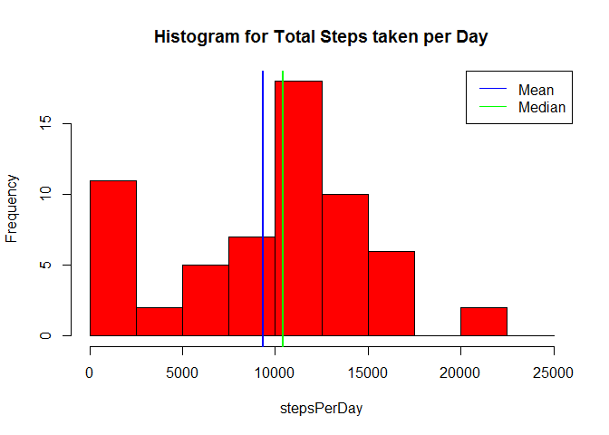
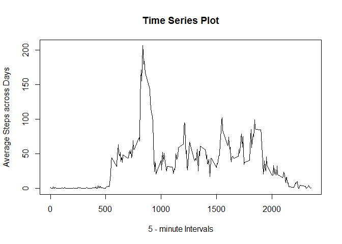
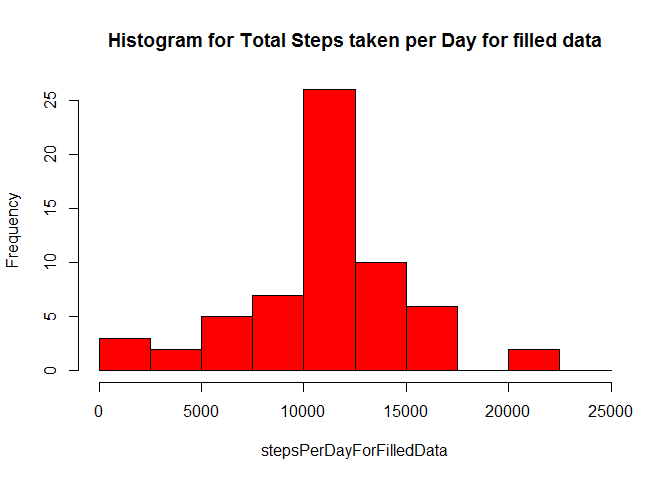

# Reproducible Research: Peer Assessment 1

***
## Loading and preprocessing the data
***

*  ##### Unzipping the file:


```r
unzip("activity.zip")
```

*  ##### Load the file into a data frame:


```r
activitydata <- read.csv("activity.csv")
```

*  ##### Modifying the columns of the data frame to proper classes:


```r
activitydata <- transform(activitydata, date = as.Date(date))
```

***
## What is mean total number of steps taken per day?
***

*  ##### Total Number of steps taken per day:


```r
stepsPerDay <- with(activitydata, tapply(steps, date, sum, na.rm = TRUE))
```

*  ##### Histogram of Total steps taken per day:


```r
hist(stepsPerDay, col ="red", breaks = seq(0, 25000, by = 2500),
     main = "Histogram for Total Steps taken per Day")
abline(v = mean(stepsPerDay, na.rm = TRUE), col = "blue", lwd = 2)
abline(v = median(stepsPerDay, na.rm = TRUE), col = "green", lwd = 2)
legend("topright", legend = c("Mean", "Median"), lty = 1, col = c("blue", "green"))
```

 

*  ##### Mean and Median of Total steps taken per day:


```r
mean = mean(stepsPerDay, na.rm = TRUE)
median = median(stepsPerDay, na.rm = TRUE)
```
> * Mean = **9354.2295082**   
> * Median = **10395**

***
## What is the average daily activity pattern?
***

*  ##### The average number of steps taken for each 5 min interval, averaged across all days:

```r
intervalSteps <- with(activitydata, tapply(steps, interval, mean, na.rm = T))

# Make intervalSteps into a data frame
intervalStepsDF <- data.frame("interval" = as.numeric(names(intervalSteps)), 
                              "steps" = intervalSteps)
```

*  ##### Time series plot of 5-minute interval (x-axis) and steps (y-axis):


```r
with(intervalStepsDF, plot(interval, steps, type = "l", xlab = "5 - minute Intervals",
                           ylab = "Average Steps across Days", 
                           main = "Time Series Plot"))
```

 

*  ##### Which 5-minute interval contains the maximum number of steps:


```r
maxIntervalValue = intervalStepsDF[rev(order(intervalStepsDF$steps)), 1][1]
```
> * The 5 - minute interval on average across all days that contains the maximum
number of steps is: **835**

***
## Imputing missing values
***

*  ##### Total number of missing values in the dataset:


```r
numOfMissingValues <- sum(!complete.cases(activitydata))
```

> * Missing values in dataset: **2304**

*  ##### Strategy:
Fill the missing values with average steps for 5-minute intervals across days.

```r
## Creating the new dataset with imputed missing values
fillData <- activitydata
fillData$steps <- ifelse(is.na(fillData$steps), 
                         intervalStepsDF[as.character(fillData$interval),2], 
                         as.numeric(fillData$steps))
```

* ##### Histogram of total number of steps taken each day:


```r
stepsPerDayForFilledData <- with(fillData, tapply(steps, date, sum))
hist(stepsPerDayForFilledData, col ="red", breaks = seq(0, 25000, by = 2500), 
     main = "Histogram for Total Steps taken per Day for filled data")
```

 

*  ##### Mean and Median of Total steps taken per day:


```r
meanForFilledData = mean(stepsPerDayForFilledData)
medianForFilledData = median(stepsPerDayForFilledData)
```
> * Mean = **1.0766189\times 10^{4}**   
> * Median = **1.0766189\times 10^{4}**
> * This values differ from the estimates when the missing values where removed.

* ##### Impact of imputing missing data on the estimates of the total daily number of steps:
> 1. The average number of steps per day have increased by arount 700 steps.
> 2. Mean and Median are equal making the histogram symmetrical about the mean, 
removing the left skewness that existed before because of missing values.
> 3. Mean imputation causes the sample size to be overestimated.
> 4. Variance is underestimated.

***
## Are there differences in activity patterns between weekdays and weekends?
***

* ##### Factor variable for weekdays and weekends:


```r
fillData$weekendCheck <- ifelse(weekdays(fillData$date) == "Saturday" | 
                                weekdays(fillData$date) == "Sunday", 
                                "weekend", "weekday")
```

* ##### Panel plot for average steps for 5-minute intervals for Weekdays and Weekends:


```r
intervalStepsWeekDays <- with(fillData, {
        fillDataNew <- transform(fillData, interval = factor(interval), 
                                 weekendCheck = factor(weekendCheck))
        f <- interaction(interval, weekendCheck)
        tapply(steps, f, mean)})

intervalStepsWeekDaysDF <- data.frame("interval" = as.numeric(gsub("[a-z.]", "", 
                                                                   names(intervalStepsWeekDays))), 
                                      "weekendCheck" = as.factor(gsub("[0-9.]","", 
                                                                      names(intervalStepsWeekDays))),
                                      "steps" = intervalStepsWeekDays)

## Plotting the lattice plot for 5-minute intervals for weekdays and weekends
library(lattice)
xyplot(steps~interval | weekendCheck, 
       data = intervalStepsWeekDaysDF, 
       layout = c(1,2),
       xlab = "Interval",
       ylab = "Number of steps", 
       type = "l")
```

 

